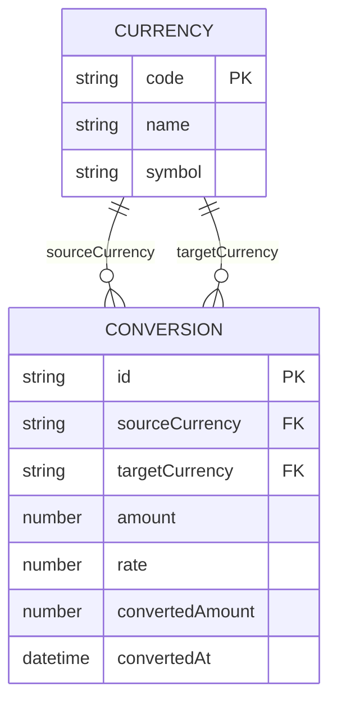

# Domain Model

The domain is small: a fixed catalog of supported currencies and the rate
between any two of them at the moment a conversion is requested.

- **Currency** — one of the curated shortlist of major currencies the app
offers in its pickers (ISO 4217 code, display name, symbol).
- **Conversion** — the result of converting an amount from one currency to
another at a rate fetched at request time; not persisted beyond the
response, since the PRD scopes out history and saved pairs.

