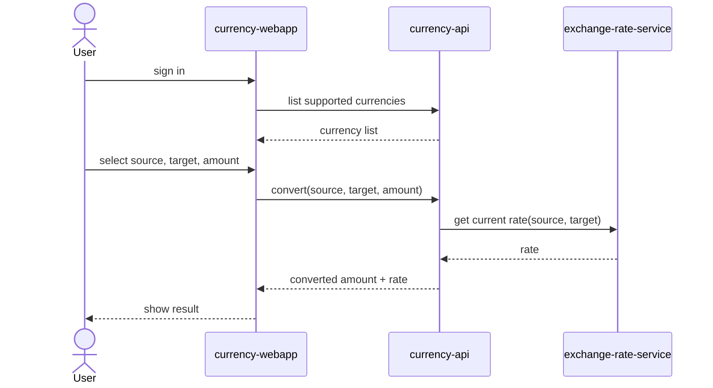

# Convert Currency

A signed-in User picks a source and target currency, enters an amount, and
sees the converted result along with the rate used.

```mermaid
sequenceDiagram
    actor User
    participant currency-webapp
    participant currency-api
    participant exchange-rate-service

    User->>currency-webapp: sign in
    currency-webapp->>currency-api: list supported currencies
    currency-api-->>currency-webapp: currency list
    User->>currency-webapp: select source, target, amount
    currency-webapp->>currency-api: convert(source, target, amount)
    currency-api->>exchange-rate-service: get current rate(source, target)
    exchange-rate-service-->>currency-api: rate
    currency-api-->>currency-webapp: converted amount + rate
    currency-webapp-->>User: show result
```

